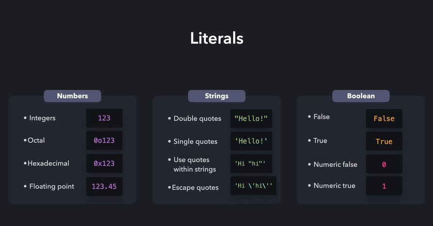
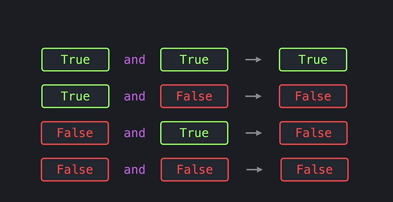
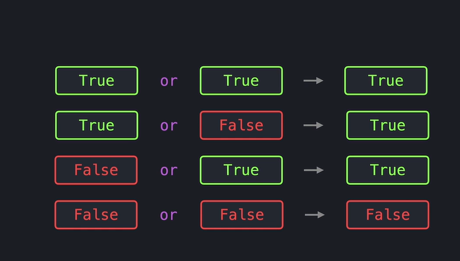
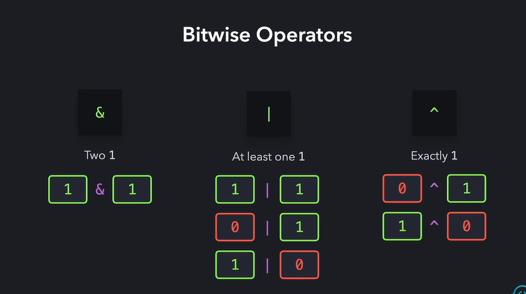
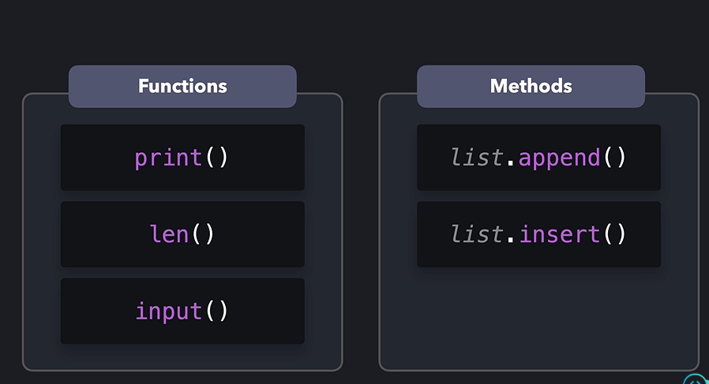

# python for devops 

* Sntax, variable, data types, numbers and strings
* conditional Statements (else, if, and elif )
* loops, logic and bit operations, lists, tuples, and dictionaries 


## python fundation conspets 

    - Basic Concepts 
    - Data Types 
    - Operators
    - Flow Control 
    - Data Collections 
    - Functions & Exceptions 


# Print Function


# Literals

* Literal types:
    1. Integers
       - octal numbers
       - hexadecimal numbers 
    2. floating point 
    3. Strings
    4. Booleans 



# Operators 

* arthmetic Operators 
    - **    2 ** 3 --> exponential 


# Comparison Operators 

- ==  this is equle `print(2 == 2)` print the `True`
- != this is not equle 
- > 
- >=
- < 
- <=


## Operators 

```python
age1 = 24
age2 = 16

if( age1 >= 18 and age2 >= 18): # Both ages are higher then 18
    print("you are both adults")
elif( age1 >= 18 or age2 >= 18 ): # One age is higher then 18
    print("One of you is an adult")
else:
    print("You are you childern")

```
key words 
--------



not `True` --> False
not `False` --> True 

* example-2 

```python
is_hungry = False
if(not is_hungry):
  print("You are not hungry")
else:
  print("You are hungry")

```

## Bitwise Operators 

conjuction --> & 
Disjuction --> | 
Negation --> ~
Exclusive --> ^




# Lists

example: `len()`

countries = ["USA", "Canada", "India"]
print(countries[0])
len(countries)
print(countries[-1])
* delete item `del countries[1]`



* `list.append()`  --> add the new value in end of the list
* `list.insert()`  --> add the new value in between methods 
* swap this values on python lists use `countries[0], countries[1] = countries[1], countries[0]`
* list.sort() --> set the values on lowest value to highets value 
* list.reverse() --> set the reverse order 
* list.pop() --> hide the value 

### iterating lists 

* find the total ages os list 
```python
ages = [56, 72, 24, 46]
total = 0
for age in ages: 
    total += age 
average = total / len(ages)
print(average)

```

### Slicing Lists 

* list[start:end]

### Nested Lists (2D/3D)


# Functions in python 

    - print()
    - input()
    - len()

* function must used on `def`

example
```python
def input_number():
    return int(input("Enter the number: "))

input1 = input_number()
input2 = input_number()
input3 = input_number()

input1

print(input1)

```